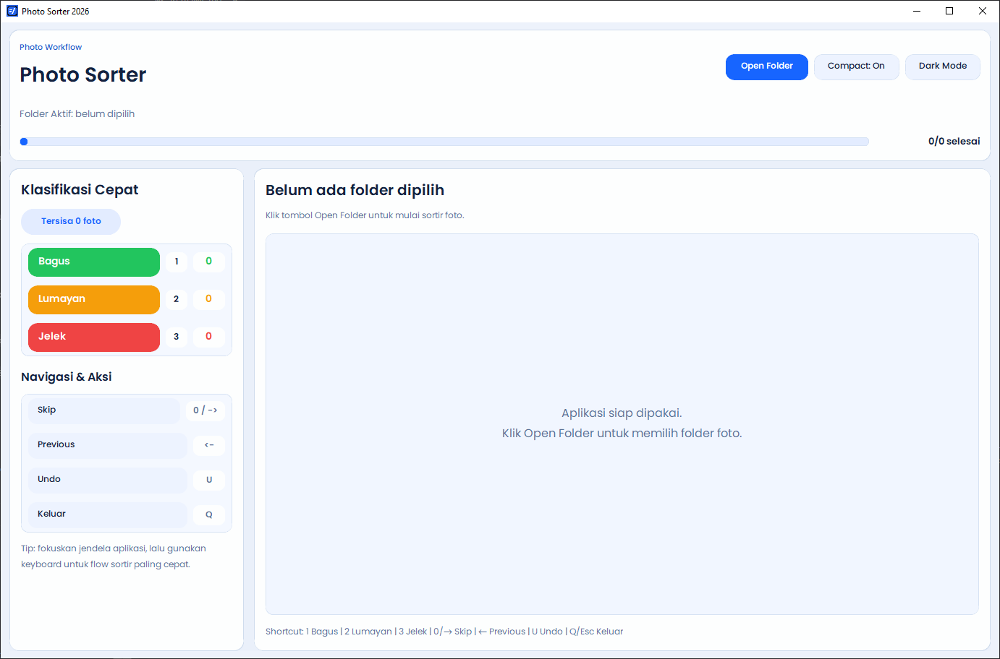
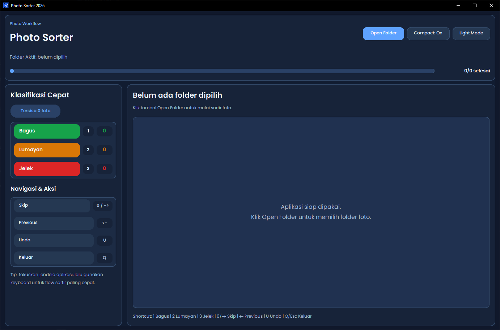
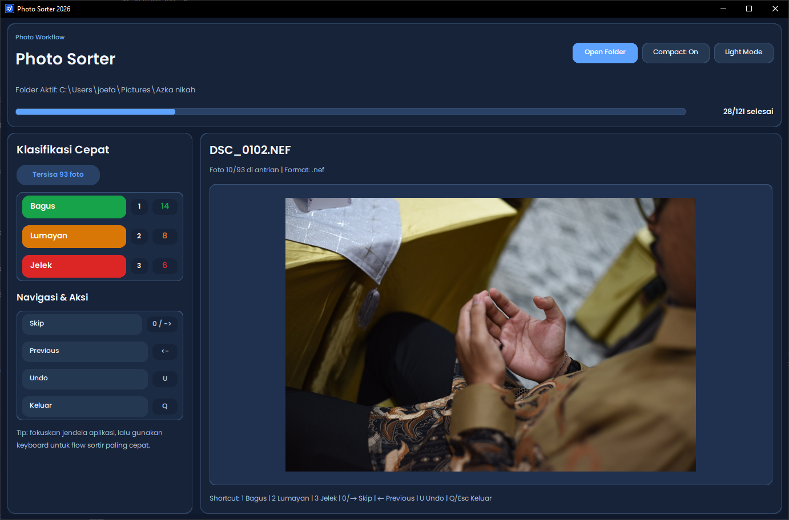
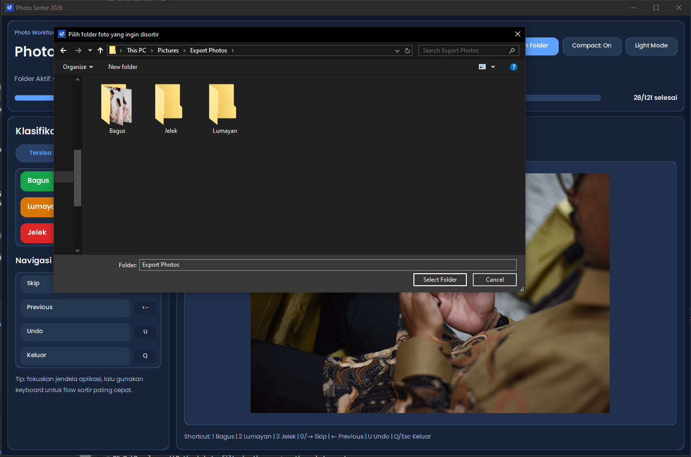

# Photo Sorter

English version: [README.en.md](README.en.md)

Aplikasi desktop untuk sortir foto cepat ke 3 kategori:

- `Bagus` (`1`)
- `Lumayan` (`2`)
- `Jelek` (`3`)

File tidak diubah kualitasnya. Aplikasi hanya memindahkan file ke folder kategori.

## Aplikasi Ini Untuk Apa

Photo Sorter dibuat untuk mempercepat proses culling foto dalam jumlah besar, terutama setelah sesi foto/event, dengan alur keyboard-first.

## Fitur Utama

- Sorting cepat dengan shortcut keyboard.
- Navigasi foto berikut/sebelumnya.
- Undo pemindahan terakhir.
- Counter kategori real-time.
- Struktur folder kategori otomatis (`Bagus`, `Lumayan`, `Jelek`).
- Dukungan format umum gambar dan RAW.
- Theme light/dark (versi Electron).
- Build desktop installer.

## Screenshoot Demo

### Tampilan awal (Light Mode)



### Tampilan awal (Dark Mode)



### Proses sortir foto



### Dialog pilih folder



## Cara Penggunaan (User)

1. Buka aplikasi.
2. Pilih folder sumber foto.
3. Lihat preview foto aktif.
4. Tekan shortcut:
   - `1` pindah ke `Bagus`
   - `2` pindah ke `Lumayan`
   - `3` pindah ke `Jelek`
   - `0` atau `→` skip ke foto berikutnya
   - `←` kembali ke foto sebelumnya
   - `U` undo pemindahan terakhir
   - `Q` / `Esc` keluar aplikasi
5. Hasil sort ada di subfolder kategori dalam folder sumber.

## Struktur Repo

- `electron_app/`: versi utama berbasis Electron (Windows/macOS/Linux).
- `python_app/`: versi Python (legacy/reference, Windows-focused build EXE/MSI).

## Menjalankan Dari Source

### Electron (Direkomendasikan)

```bash
cd electron_app
npm install
npm run dev
```

Build release:

```bash
cd electron_app
npm run dist:win
npm run dist:mac
npm run dist:linux
```

Catatan RAW di Electron:

- Preview RAW memakai `exiftool`.
- Sumber `exiftool`: env `EXIFTOOL_PATH`, bundled binary, atau PATH sistem.
- Jika decoder tidak ada, file RAW tetap bisa disortir, hanya preview yang jadi placeholder.

### Python (Legacy)

```powershell
cd python_app
pip install -r requirements.txt
python photo_sorter.py
```

Build EXE + MSI:

```powershell
cd python_app
.\scripts\build_all.ps1 -ProductVersion 1.0.0
```

Build archive distribusi (EXE + MSI + ZIP):

```powershell
cd python_app
.\scripts\package_release.ps1 -ProductVersion 1.0.0 -BuildIfMissing
```

CI/CD otomatis (GitHub Actions):

- Workflow: `.github/workflows/python-app-ci-cd.yml`
- Artifact CI berisi `photo_sorter.exe`, `photo_sorter.msi`, dan ZIP release.
- Push tag `vX.Y.Z` akan publish EXE/MSI/ZIP ke GitHub Release.

Dokumentasi detail per versi:

- `electron_app/README.md`
- `python_app/README.md`
